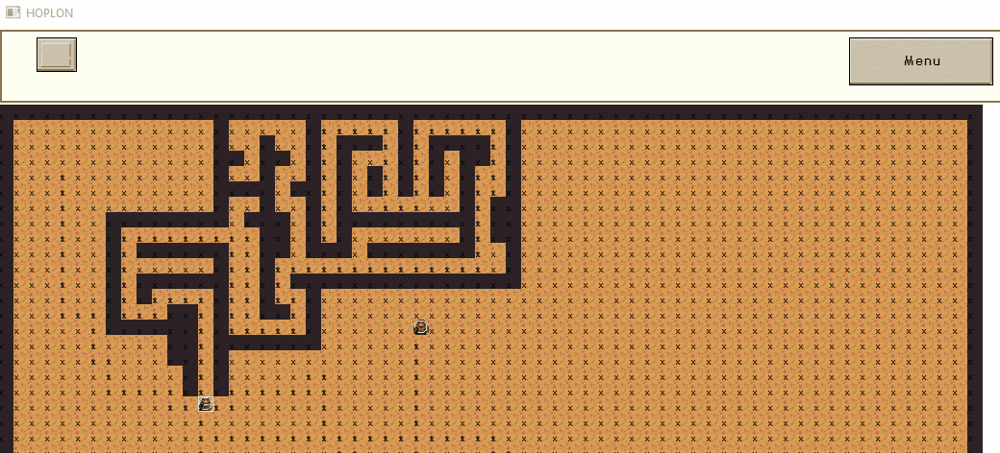
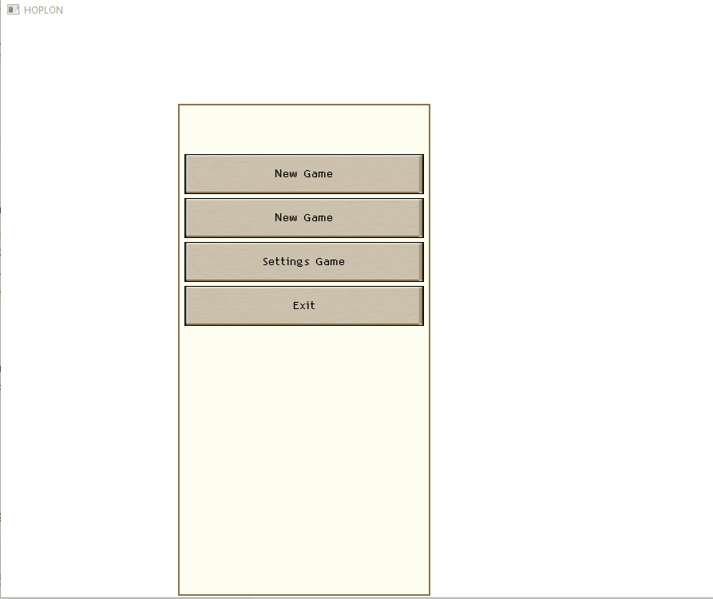

Copyright Notice:
-----------------
© 2021 Stephen Tatarczuk
The files within this repository are copyrighted by Stephen Tatarczuk unless otherwise noted
and may not be redistributed without written permission.

# About

This is an Entity Component System Architecture game engine aimed at 2D tile based games. It features tools for GUI development and top-down game style development.

# Install/Use

Dependencies:
SDL2
SDL2_TTF
SDL2_Image
C++ 17 (G++ version 9.3 or above for use with std::filesystem)

## Linux 
* Install the SDL2 development libraries with your package manager
	* sudo yum install SDL2-devel
	* sudo yum install SDL2_image-devel
	* sudo yum install SDL2_ttf-devel
* Included CmakeLists.txt should be able to find them after that.
### Clion
* Ensure Clion settings are pointed at C++ compiler
* Open top level folder with CMakeLists.txt
* Build as normal
## Windows
* Download SDL2 development libraries
* SDL2, SDL2_image, and SDL2_ttf.
	* https://www.libsdl.org/projects/SDL_image/release/
	* https://www.libsdl.org/projects/SDL_ttf/release/
	* https://www.libsdl.org/download-2.0.php
* Place the folders in the SIXEngine/vclib/[compiler] folder
	* Example, SIXEngine/vclib/mingw/SDL2-2.0.14 (and image, and ttf)
* The SDL/image/ttf dlls must be made available to the built executables. You can either add the folders with the dlls to your Windows path, or copy paste the dlls into the same folder as the exe.
### Visual C++	
* Make sure cmake plugin is installed
* Open the top level folder with the CMakeLists.txt
* Build as normal
### MINGW/Visual Terminal
* To build in terminal, create a "build" directory at the same level as this readme.
* "cd build"
* "cmake .."
* "make" 
* Run the resulting application
### Codeblocks/Other MinGW/GCC IDE
* You must have a C++17 mingw installed and set up with CodeBlocks.
** Make sure the C++17 compiler flags are set. std::filesystem is the main C++17 dependency in this project.
* Download cmake gui
* Point cmake gui to this folder as the source
* Create a build folder in this folder and point cmake to it as the build destination
* Click "Configure" 
* When cmake asks for compiler information, tell it to use Mingw Makefiles or Codeblocks Mingw Makefiles
* Click "Generate" -> will generate makefiles and a codeblocks project (CBP)
* Open Codeblocks and open the CPB
* Build/run as normal
* All the SDL DLLs must be on your path or copy/pasted to the generated exe's location

# Code a new application

Note the presence of the src/apps folder. 

This contains programs with a main loop, applications, programs that will become an .exe, etc.

cmakelists.txt must be told about any new main applications directly. Note the format of the "add_executable" and "target_link_libraries" in cmakelists.txt and copy accordingly for any new application.

